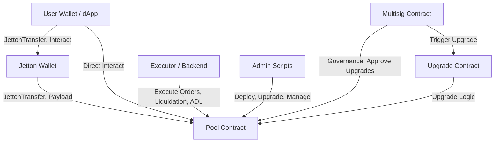
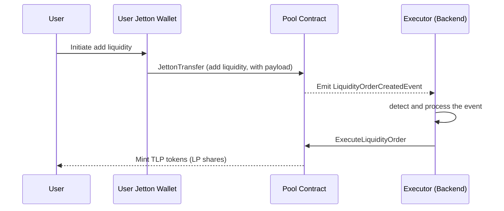
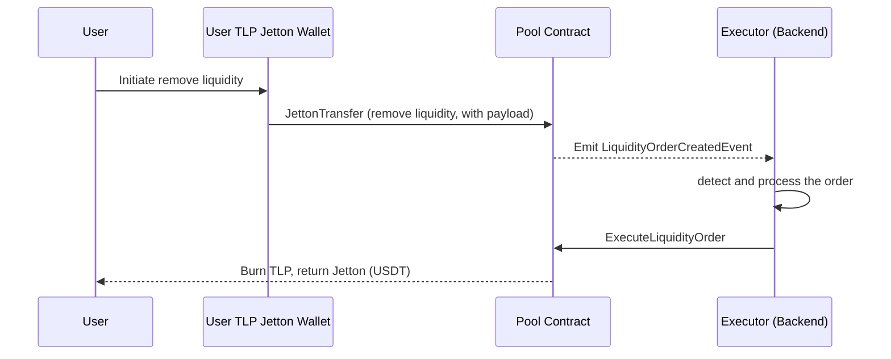
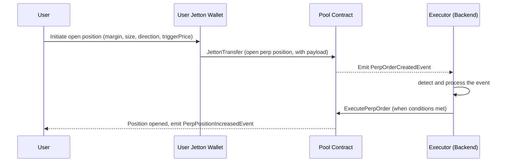
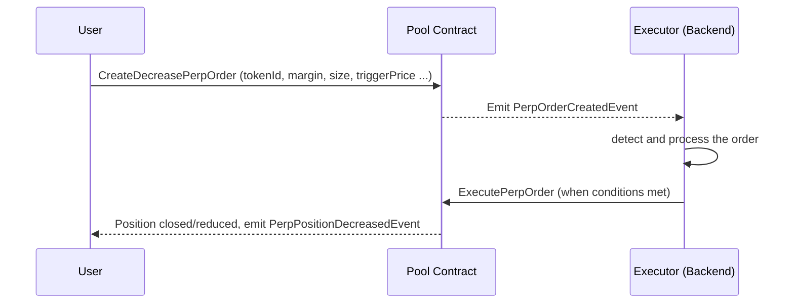
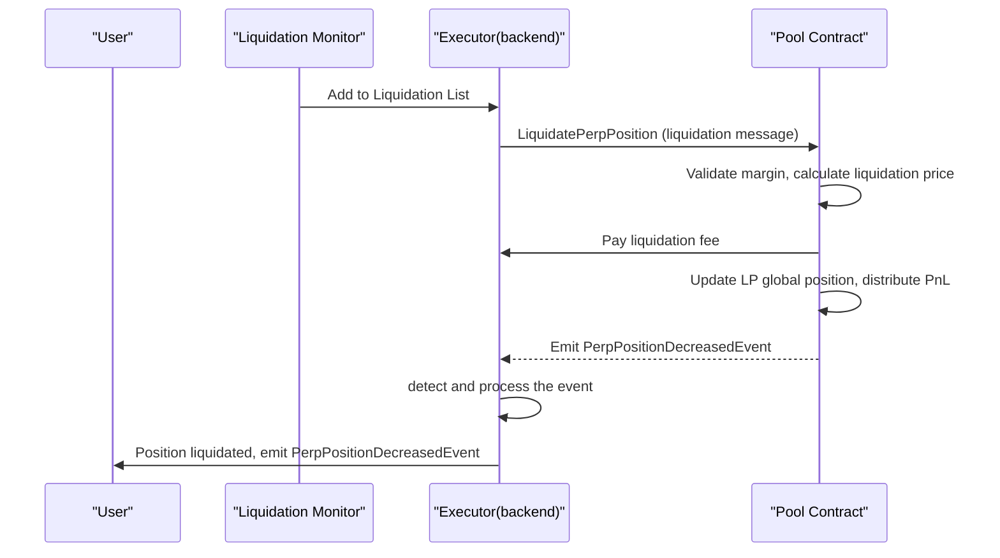
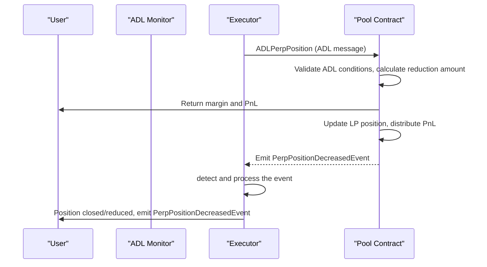

# Architecture & Business Flow

## 1. System Architecture
### 1.1 Architecture Overview Diagram

## 2. Component Interaction
- Users interact with Jetton and Pool contracts via wallets or dApps.
- Protocol upgrades and sensitive actions require multisig approval.
- Scripts in the `scripts/` directory facilitate deployment, upgrades, and operational tasks.

## 3. Business Process Flow
### 3.1 Provide Liquidity
**Process Overview:** Users add Jetton (USDT) to the pool via wallet or dApp and receive TLP shares.

**Detailed Steps:**
1. The user selects the amount of Jetton to add and pays the execution fee.
2. The user's Jetton wallet sends a JettonTransfer to the Pool contract, with the payload marked as "add liquidity".
3. The Pool contract records the order and emits an event.
4. The backend listens for the event and calls `ExecuteLiquidityOrder` to process the order, minting TLP to the user.
5. The user receives TLP shares.

**Key Contract Interactions:**
- `JettonTransfer` (add liquidity payload)
- `ExecuteLiquidityOrder`

**Related Events:**
- `LiquidityOrderCreatedEvent`
- `LiquidityPoolChangedEvent`

### 3.2 Remove Liquidity
**Process Overview:** Users redeem TLP to receive Jetton (USDT).

**Detailed Steps:**
1. The user selects the amount of TLP to redeem and pays the execution fee.
2. The user's TLP wallet sends a JettonTransfer to the Pool contract, with the payload marked as "remove liquidity".
3. The Pool contract records the order and emits an event.
4. The backend listens for the event and calls `ExecuteLiquidityOrder` to process the order, burning TLP and returning Jetton.
5. The user receives Jetton (USDT), and TLP is burned.

**Key Contract Interactions:**
- `JettonTransfer` (remove liquidity payload)
- `ExecuteLiquidityOrder`

**Related Events:**
- `LiquidityOrderCreatedEvent`
- `LiquidityPoolChangedEvent`

### 3.3 Open Perpetual Position (Trade)
**Process Overview:** Users open a perpetual contract position.

**Detailed Steps:**
1. The user specifies margin, position size, direction, and trigger price.
2. The user's Jetton wallet sends a JettonTransfer to the Pool contract, with the payload marked as "open position".
3. The Pool contract records the order and emits an event.
4. The backend listens and executes the order when conditions are met, opening the position.

**Key Contract Interactions:**
- `JettonTransfer` (open position payload)
- `ExecutePerpOrder`

**Related Events:**
- `PerpOrderCreatedEvent`
- `PerpPositionIncreasedEvent`

### 3.4 Close/Decrease Perpetual Position
**Process Overview:** Users close or decrease a position.

**Detailed Steps:**
1. The user specifies the position, amount to decrease, and trigger price.
2. The user or backend sends a message to the Pool contract to create a "decrease position" order.
3. The Pool contract records the order and emits an event.
4. The backend listens and executes the order when conditions are met, closing or decreasing the position.

**Key Contract Interactions:**
- `CreateDecreasePerpOrder`
- `ExecutePerpOrder`

**Related Events:**
- `PerpOrderCreatedEvent`
- `PerpPositionDecreasedEvent`

### 3.5 Liquidation Process
**Overview:** When a user's position margin ratio falls below the maintenance margin requirement, any executor can initiate liquidation.

**Detailed Steps:**
1. Monitor the position margin ratio and detect if it falls below the threshold.
2. The executor sends a `LiquidatePerpPosition` message to the Pool contract.
3. The contract validates the conditions, calculates the liquidation price, fee, and LP PnL.
4. The position is settled, and the liquidation fee is distributed.
5. Event notification.

**Key Contract Interactions:**
- `LiquidatePerpPosition`

**Related Events:**
- `PerpPositionDecreasedEvent`

### 3.6 Auto-Deleveraging (ADL) Process
**Overview:** In extreme market conditions, the system automatically deleverages to protect LPs.

**Detailed Steps:**
1. Monitor LP risk and trigger ADL conditions.
2. The executor sends an `ADLPerpPosition` message to the Pool contract.
3. The contract validates the conditions and forcibly reduces positions.
4. The position is settled, and margin and PnL are returned.
5. Event notification.

**Key Contract Interactions:**
- `ADLPerpPosition`

**Related Events:**
- `PerpPositionDecreasedEvent`

## 4. Index Price Provider

The protocol maintains a real-time system index price for each trading pair. This index price is calculated every second by sampling and computing a weighted average from multiple price sources, such as Pyth, Binance, and other major exchanges. The process is as follows:

- Every second, the backend collects price data from Pyth, Binance, and other configured exchanges.
- Each source may have a different weight, reflecting its reliability and market share.
- The system computes a weighted average of all available prices to form the current index price.
- This index price is used for order execution, liquidation, ADL, and other protocol logic to ensure fairness and resistance to manipulation.

**Key Points:**
- The index price is updated every second.
- Multiple sources are used to reduce the risk of manipulation or outliers.
- The weighting of each source can be configured.

---

## 5. Order Price Mechanism

For market orders, the protocol determines the actual transaction price based on the system index price at the moment the order arrives on-chain. Specifically:

- When a user submits a market order, the order is broadcast and included in a blockchain transaction.
- The protocol samples the current system index price (see previous section) at the exact time the order is confirmed on-chain.
- This sampled index price is used as the execution price for the market order, regardless of the price at the time of order submission.
- This mechanism ensures fairness and transparency, and prevents manipulation based on off-chain price movements or delays.

**Key Points:**
- The execution price for a market order is always the on-chain index price at the moment of order arrival.
- Users should be aware of potential price changes between order submission and on-chain confirmation.

---

## 6. Funding Fee and Rollover Fee

The protocol charges both funding fees and rollover fees to perpetual positions every 5 minutes.

- **Rollover Fee:**
  - Charged at a fixed interval (every 5 minutes).
  - The amount is determined by the platform's configured rollover fee rate.
  - This rate is set by governance and applies equally to all positions.
  - **Calculation Formula:**
    - `rolloverFee = position notional value × rollover fee rate`

- **Funding Fee:**
  - Calculated and accumulated every 5 minutes, but only charged/settled once per hour (although the funding fee is charged every hour, it is not immediately settled and transferred on-chain. Instead, the accumulated funding fee is only settled and paid on-chain when the position is operated, such as increased, decreased, or closed. This ensures efficient on-chain operations and reduces unnecessary transactions).
  - The funding fee rate is dynamically calculated based on the long-short (open interest) ratio of the trading pair.
  - This mechanism is specifically designed to balance long and short positions in the market, reducing the risk of liquidity imbalance that could otherwise threaten the stability of the protocol.
  - **Funding Rate Calculation:**
    - Funding Rate is designed to balance long and short positions and keep the perpetual price close to the index price. It is calculated and applied hourly, based on the following formulas:

    **1. Funding Rate Formula:**
    
    \[
    \text{Funding Rate} = \frac{\text{APR} + \text{clamp}(\text{Interest Rate} - \text{APR},\ 0.05\%,\ -0.05\%)}{24}
    \]
    
    - **Interest Rate (IR):** A constant parameter, adjustable by DAO governance.
    - **clamp(x, max, min):** Restricts x to the range [min, max].

    **2. Average Premium Rate (APR):**
    
    \[
    \text{APR} = \frac{1 \times PR_1 + 2 \times PR_2 + 3 \times PR_3 + \ldots + n \times PR_n}{1 + 2 + 3 + \ldots + n}
    \]
    
    - Here, \(PR_i\) is the premium rate at the i-th 5-minute interval within the hour, and n is the number of intervals in the hour (typically 12).

    **3. Premium Rate (PR) Calculation:**
    
    \[
    PR(x) = 2 \times PR_{Cap} \times (N(DR \times 3.3) - 0.5)
    \]
    
    - **PR_Cap:** Premium rate cap, varies by asset volatility (e.g., BTC = 10%, meme coins = 50%).
    - **N(x):** Normalization function mapping input to [0,1].
    - **DR (Deviation Rate):**
      \[
      DR = \frac{\text{Global User Long Position Value} - \text{Global User Short Position Value}}{\text{LP}}
      \]
      - **LP:**
        \[
        \text{LP} = (\text{Total LP Value} + \text{Unrealized PnL}) \times \text{liquidity proportion}
        \]
        - **liquidity proportion:** A parameter configured by the platform to determine the share of total LP allocated to each trading pair.

    **Key Points:**
    - Funding Rate is calculated and accumulated every 5 minutes, but only charged/settled once per hour (and only when the position is operated).
    - PR_Cap is asset-specific and set by governance.
    - The mechanism incentivizes market balance and protects LPs from liquidity imbalance.

